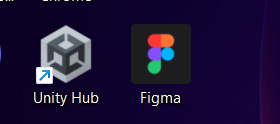
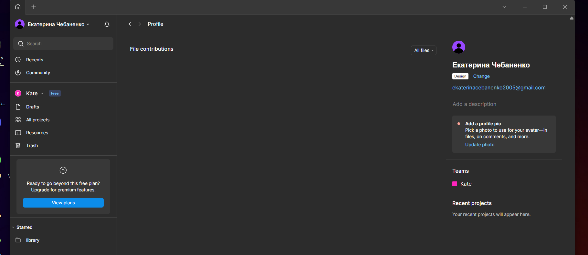

# Workshop_1 

## Тема заняття
ОГЛЯД І ПОРІВНЯЛЬНА ХАРАКТЕРИСТИКА СЕРВІСІВ ДЛЯ 
ПРОЕКТУВАННЯ КОРИСТУВАЛЬНИЦЬКИХ ІНТЕРФЕЙСІВ 

## Хід роботи

1. **Встановлення Figma Desktop**  
   Завантажила та встановила десктопну версію Figma.  

   

2. **Залогінений обліковий запис у Figma**  
   Після запуску Figma увійшла у створений акаунт. 
   

## Висновки
На практиці я:
- зареєструвала обліковий запис у Figma;
- завантажила та встановила десктопну версію програми;
- виконала перший вхід у систему.

Ця робота навчила мене:
- створювати акаунт у Figma;
- працювати з інтерфейсом Figma та підготувати середовище для подальшої роботи.

