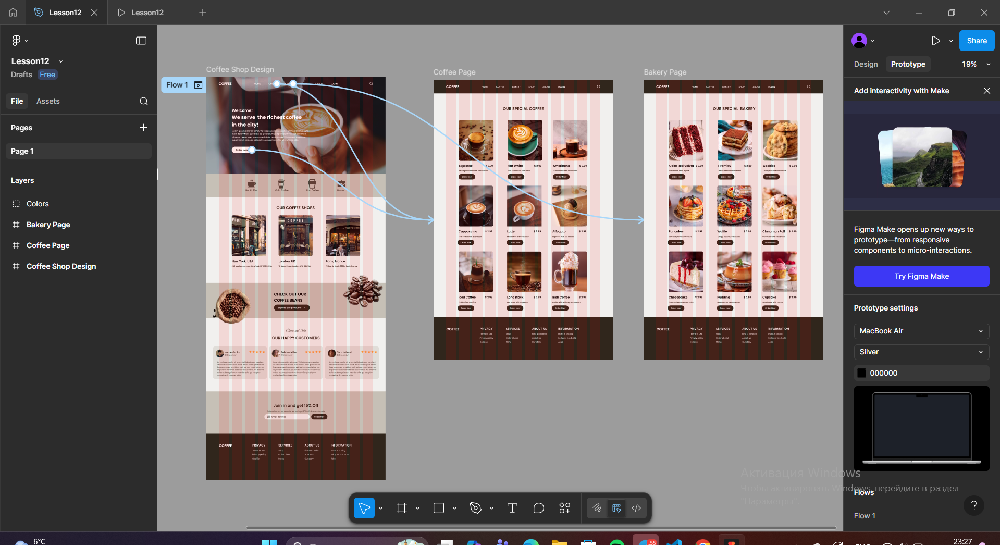
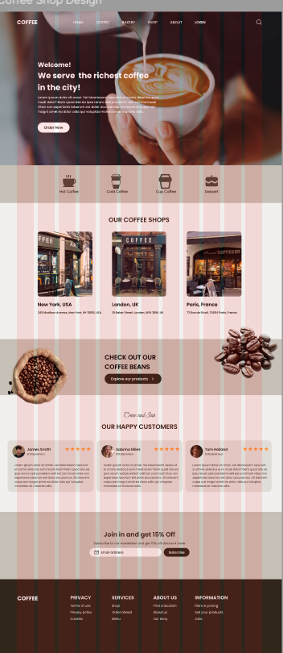
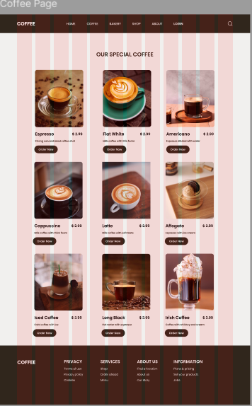
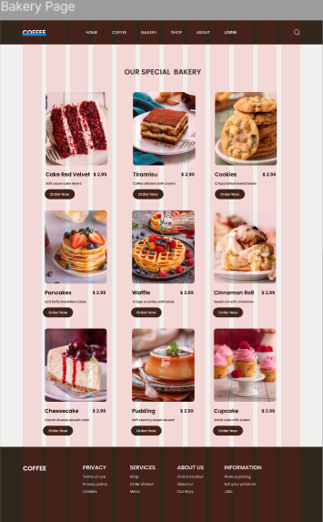

# Workshop_12

## Тема заняття
Розробка Wireframe
## Хід роботи

1. **Підготовка робочого середовища**  
У Figma я створила головний фрейм для wireframe головної сторінки сайту кав’ярні, а також два додаткові фрейми для сторінок товарів: сторінки кави та сторінки випічки. 

2. **Створення структури головної сторінки**  
Побудувала загальну структуру сайту:

-хедер з логотипом та навігаційним меню;

-головний банер з кнопкою замовлення;

-блок з категоріями (Hot Coffee, Cold Coffee, Cup Coffee, Dessert);

-секцію з локаціями кав’ярень;

-блок з кавовими зернами;

-секцію з відгуками клієнтів;

-блок з формою підписки;

-футер з додатковою інформацією.

3. **Створення сторінки “Coffee Page”**  
На окремому фреймі створила сторінку зі списком кавових напоїв.
Додала картки товарів:

-зображення напою;

-назву;

-короткий опис;

-ціну;

-кнопку “Order Now”.

4. **Створення сторінки “Bakery Page”**  
Аналогічно створила сторінку випічки.
Розмістила картки товарів. Для кожного десерту додала фото, назву, опис та кнопку замовлення.

5. **Прототипування переходів між сторінками**  
У режимі Prototype я:

-створила перехід з головної сторінки на сторінку з кавою;

-створила перехід з головної сторінки на сторінку випічки;

-створила перехід з головної сторінки на сторінку з кавою, через натискання на кнопку “Order Now”.

   
 
 
 

Посилання на проект: https://www.figma.com/design/oEC1dDsgKwWdLq1OTJOnr2/Lesson12?node-id=0-1&t=3BqyVJKNygORXfQY-1
## Висновок  
На практиці я:

-створила wireframe головної сторінки сайту кав’ярні;

-розробила дві окремі сторінки товарів: кави та випічки;
-додала картки товарів;

-налаштувала прототипування переходів між сторінками.

Ця робота навчила мене:

-створювати wireframe для багатосторінкових сайтів;

-будувати логіку навігації між сторінками;

-створювати базову взаємодію через Prototype у Figma.
