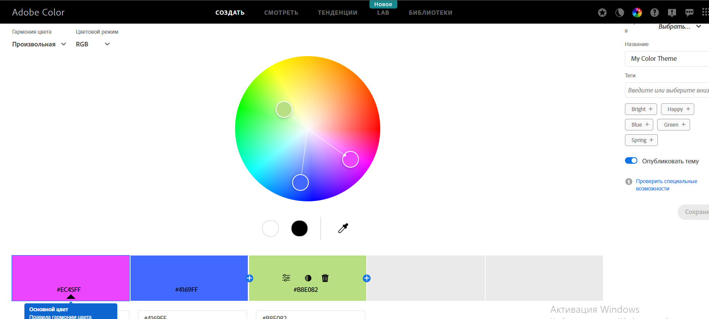
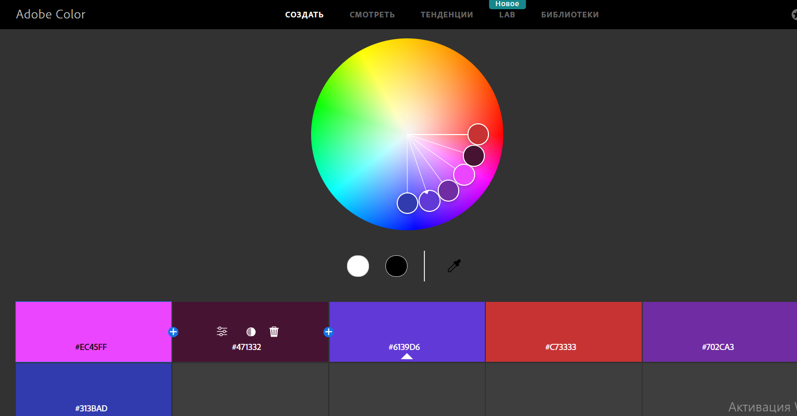
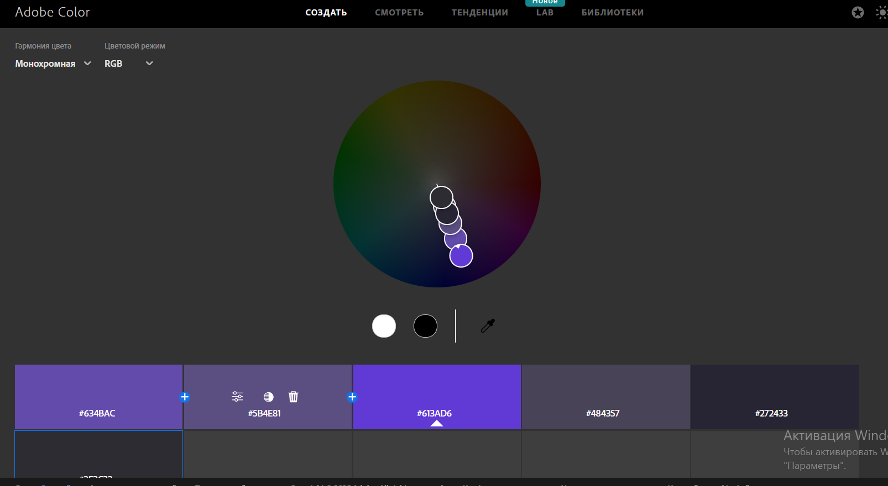
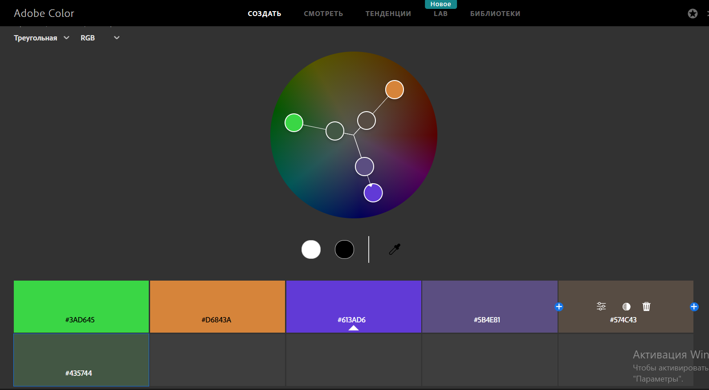
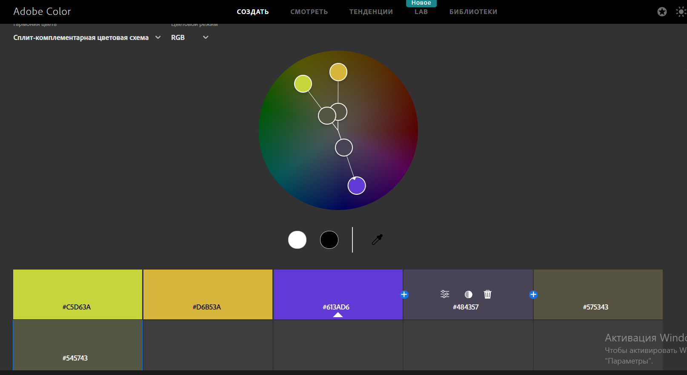
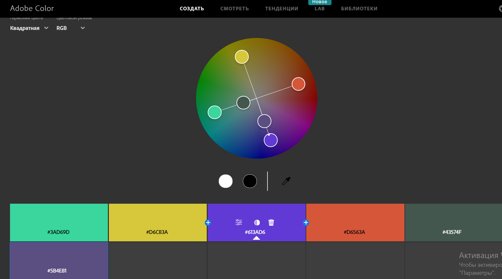
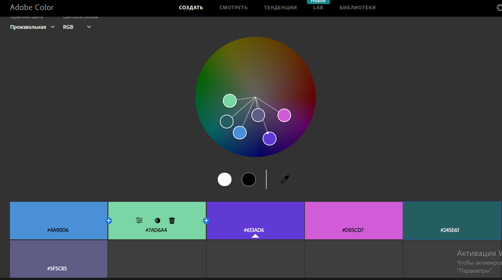
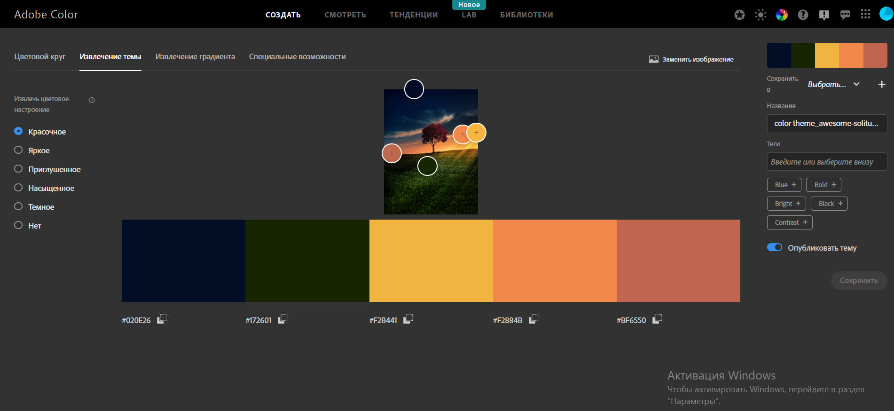
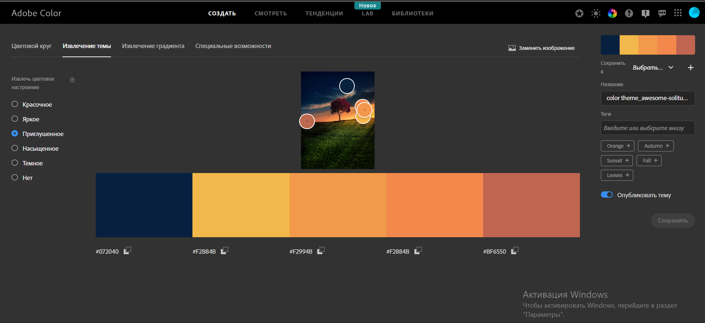
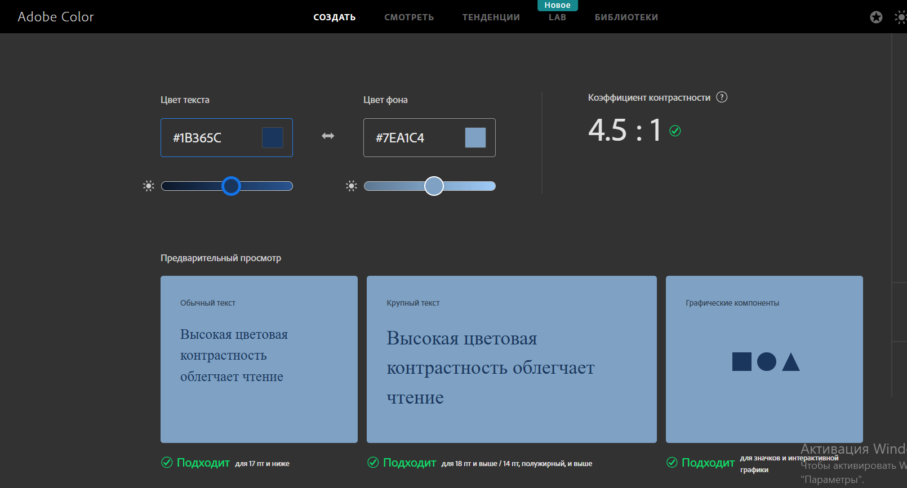

# Workshop_13

## Тема заняття
Дослідження кольорових гармоній та інструментів аналізу кольору в Adobe Color

## Мета роботи
1.Ознайомити студентів із поняттям кольорової гармонії та основними типами 
гармонії кольорів. 
2. Навчити студентів використовувати колірне колесо для побудови палітр за різними 
принципами гармонії. 
3. Ознайомити із можливостями автоматичного виділення кольорових палітр із 
зображень та створення градієнтів. 
4. Навчити перевіряти контрастність кольорових пар відповідно до стандартів 
доступності (WCAG). 
5. Закріпити навички документування та аналізу роботи з кольором у 
Markdown-форматі у GitHub-репозиторії. 

## Теоретична частина
Що таке кольорова гармонія?
Кольорова гармонія це система підбору кольорів, яка створює красиву, збалансовану палітру. Використовується, щоб посилити емоційний ефект і читабельність інтерфейсу.

Типи гармоній:

Analogous: сусідні кольори на колесі — спокійна, м’яка палітра.

Monochromatic: варіації одного відтінку (насиченість/яскравість) — чистота, мінімалізм.

Triad: три кольори на рівних відстанях — живо й барвисто.

Complementary: протилежні кольори — контраст і акцент.

Split Complementary: базовий + два сусіди до протилежного — менш агресивний контраст.

Square: чотири кольори рівномірно — різноманіття, баланс.

Custom: власний підхід.

Коротко про моделі кольору:

RGB: для екранів — значення Red/Green/Blue (0–255).

HSB (Hue, Saturation, Brightness): відтінок, насиченість, яскравість.

LAB: модель використовується в точній кольорокорекції.

WCAG (контрастність):

Рівні: AA (текст нормальний ≥ 4.5:1; великий текст ≥ 3:1), AAA (нормальний ≥ 7:1; великий ≥ 4.5:1).

Якщо пара не проходить — треба змінити яскравість/насиченість фонового або текстового кольору.

## Практична частина

### 1. Базовий колір
**Базовий колір:** `#EC45FF` 
RGB: 236,69,255
HSB:294,73,100

### 2. Палітри за типами гармонії
#### Analogous
- **HEX:** `#471332`, `#6139D6`, `#C73333`, `#702CA3`, `#313BAD`
- **Логіка:**  використовуються близькі відтінки на колірному колі
- **Емоційний ефект:** спокій, гармонія, м’якість, цілісність композиції

#### Monochromatic
- **HEX:** `#634BAC`, `#5B4E81`, `#613AD6`, `#484357`, `#272433`, `#2E2C33`

- **Логіка:** один колір з різною яскравістю
- **Емоційний ефект:** мінімалізм, стриманість, чистота та акуратність

#### Triad
- **HEX:** `#3AD645`, `#D6843A`, `#613AD6`, `#5B4E81`, `#574C43`, `#435744`

- **Логіка:** три кольори під кутом 120°
- **Емоційний ефект:** енергійність, динамічність, яскравість, життєрадісність

#### Complementary
- **HEX:** `#D6C83A`, `#604E96`, `#613AD6`, `#817D4E`, `#33322C`, `#484357`

- **Логіка:** протилежні кольори
- **Емоційний ефект:** сильний контраст, напруга, акцентування уваги

#### Split Complementary
- **HEX:** `#C5D63A`, `#D6B53A`, `#613AD6`, `#484357`, `#575343`, `#545743`

- **Логіка:** контраст м’якший, ніж у звичайній комплементарній
- **Емоційний ефект:** збалансований контраст, яскравість без різкості

#### Square
- **HEX:** `#3AD69D`, `#D6C83A`, `#613AD6`, `#D6563A`, `#43574F`, `#5B4E81`

- **Логіка:** 4 кольори через рівні інтервали
- **Емоційний ефект:** різноманіття, складність, баланс між активними кольорами

#### Custom
- **HEX:** `#4A90D6`, `#7AD6A4`, `#613AD6`, `#D05CD7`, `#245E61`, `#5F5C85`

- **Логіка:** власна побудова на основі естетичного балансу
- **Емоційний ефект:** індивідуальність, креативність, сучасний настрій

### 3. Extract Theme
**Image used:** 
- **Colorful palette:** HEXs: `#020E26`, `#172601`, `#F2B441`, `#F2884B`, `#BF6550`

  
- **Muted palette:** HEXs: `#072040`, `#F2B84B`, `#F2994B`, `#F2884B`, `#BF6550`
  
**Яка палітра краще підходить для UI:** Muted краще підходить для інтерфейсу, бо кольори спокійні та не ріжуть очі. 
**Пояснення:** Muted-палітра краще підходить для інтерфейсу, оскільки має приглушені, спокійні кольори, які не перевантажують зір користувача, покращують читабельність тексту та створюють комфортне сприйняття інформації під час тривалого користування додатком або сайтом.

### 4. Extract Gradient
- **Gradient stops (3):** `#021130`, `#895025`, `#0C1804`

**Застосування:** Градієнт можна використати для hero-блоку сайту.

### 5. Accessibility (контраст)
- **Пара кольорів:** фон `#7EA1C4`, текст `#1B365C`
- **Contrast ratio:** 4.51:1
- **AA (normal):** pass
- **AAA (large):** pass

---

## Висновок
Під час виконання цієї практичної роботи я ознайомилася з поняттям кольорової гармонії та основними типами гармоній. Навчилася працювати з колірним колесом в Adobe Color та створювати палітри за різними принципами: Analogous, Monochromatic, Triad, Complementary, Split Complementary, Square та Custom.

Я отримала практичні навички автоматичного створення палітр із зображень у режимі Extract Theme, навчилася порівнювати Colorful та Muted. Також навчилася створювати градієнти на основі зображень за допомогою інструменту Extract Gradient.

Також увагу було приділено перевірці контрастності кольорів відповідно до стандартів доступності WCAG.

Отримані знання та навички є корисними для подальшої роботи в UI/UX-дизайні, оскільки правильний підбір кольорів впливає на зручність користування та якість інтерфейсу.

