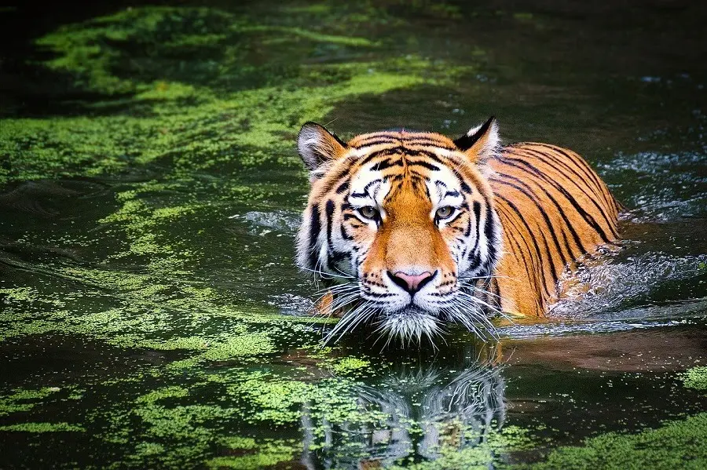
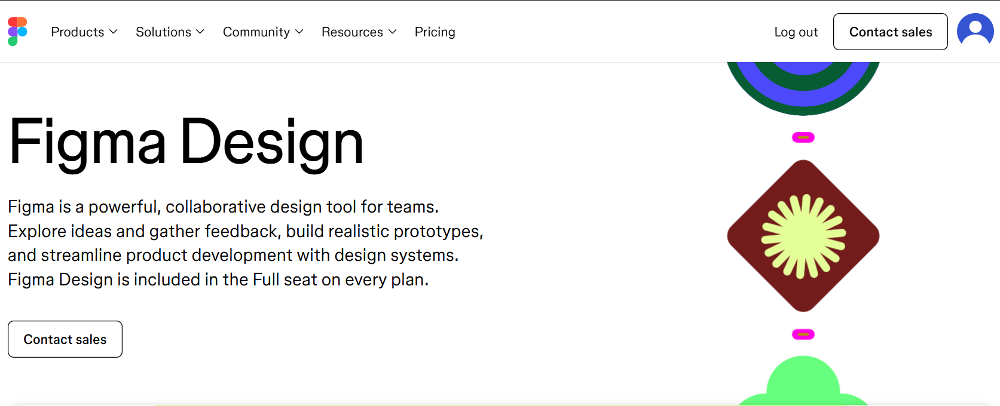
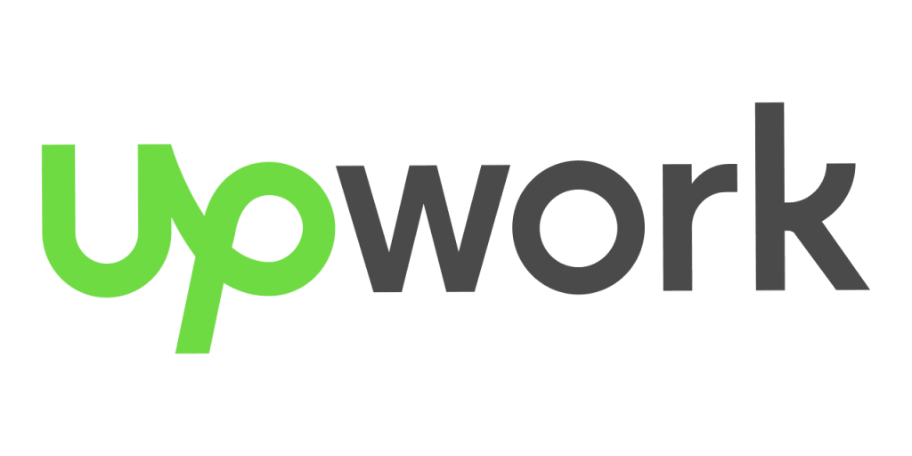

# Workshop_14

## Тема заняття  
Оптимізація зображень за допомогою Squoosh

## Мета роботи  
Ознайомити студентів із методами стиснення зображень та їхнім впливом на якість.
Навчити визначати оптимальний баланс між якістю та розміром файлу.
Ознайомити студентів із різними типами стиснення: без втрат (lossless) та з втратами (lossy).
Дослідити вплив зміни розміру на якість зображення та вагу файлу.
Навчитися адаптувати зображення для різних цільових застосувань:
Веб (оптимізація для швидкого завантаження).
Мобільні пристрої (зменшені розміри, ефективне стиснення).
Retina-дисплеї (2x, 3x версії для збереження якості).
Закріпити навички документування та аналізу результатів у Markdown-форматі у GitHub-репозиторії.

## Теоретична частина

Що таке Squoosh і як він працює?

Squoosh це безкоштовний онлайн-інструмент для стиснення та оптимізації зображень. Він працює у браузері й не потребує встановлення програм.

Принцип роботи Squoosh:

Користувач завантажує зображення.

Обирає формат та тип стиснення.

Налаштовує рівень якості, розмір тощо.

Завантажує оптимізований файл на комп’ютер.

Формати зображень та типи стиснення
Стиснення без втрати якості (lossless)

При такому стисненні: якість зображення не погіршується, змінюється тільки розмір файлу.

Основні формати:

PNG — якісний формат без втрат, часто використовується для скріншотів і графіки з текстом.

WebP — сучасний формат без втрати якості, має меншу вагу, ніж PNG.

Перевага: повне збереження якості
Недолік: файл важить більше, ніж при lossy-стисненні

Стиснення з втратою якості (lossy)

При такому стисненні: частина деталей зображення втрачається, зате вага файлу значно зменшується.

Основні формати:

MozJPEG — оптимізований JPEG для вебу.

WebP (lossy) — сучасний формат із хорошим балансом якості та розміру.

AVIF — новітній формат із дуже сильним стисненням.

Перевага: дуже мала вага
Недолік: при низькій якості можуть з’являтися артефакти

Зміна розміру зображення та її вплив

Зміна розміру (Resize) — це зменшення або збільшення ширини та висоти зображення.

Якщо зменшувати розмір: файл стає значно легшим, швидше завантажується на сайті, втрата якості мінімальна.

Якщо збільшувати розмір: різкість може погіршитися, файл стає важчим.

Для вебу рекомендується: не завантажувати зображення більші, ніж потрібно для відображення на екрані.

Оптимізація зображень для Retina-дисплеїв

Retina-дисплеї мають високу щільність пікселів, тому якщо показати звичайне зображення 1x — воно виглядає розмитим, тому використовують зображення: 2x (у 2 рази більше), 3x (у 3 рази більше).

Адаптивні зображення у вебі (srcset)

srcset — це спеціальний атрибут в HTML, який дозволяє браузеру: автоматично вибирати потрібну версію зображення, залежно від: розміру екрана, щільності пікселів, типу пристрою.

Завдяки srcset: на слабкі пристрої завантажується легке фото, на Retina — якісне, сайт працює швидше та ефективніше.

---

## 1. Початкові зображення

| Тип | Файл | Формат | Розмір |
|------|--------|--------|--------|
| Фото | photo_original.jpg | JPG | 235 KB |
| Скріншот | screenshot_original.png | PNG | 106 KB |
| Графіка з текстом | graphics_original.png | PNG | 9,06 KB |

---

## 2. Lossless стиснення

### Photo
- PNG → 1,16 MB → `photo_png_lossless.png`
- WebP → 728 KB → `photo_webp_lossless.webp`

### Screenshot
- PNG → 125 KB → `screenshot_png_lossless.png`
- WebP → 41,3 KB → `screenshot_webp_lossless.webp`

### Graphics
- PNG → 31,1 KB → `graphics_png_lossless.png`
- WebP → 7,16 KB → `graphics_webp_lossless.webp`

---

## 3. Lossy стиснення

### Photo

| Формат | 100% | 75% | 50% |
|--------|------|------|------|
| MozJPEG | 547 KB | 120 KB | 74,4 KB |
| WebP | 360 KB | 143 KB | 112 KB |
| AVIF | 389 KB | 196 KB | 112 KB |

### Screenshot

| Формат | 100% | 75% | 50% |
|--------|------|------|------|
| MozJPEG | 305 KB | 62,6 KB | 43,6 KB |
| WebP | 100 KB | 45 KB | 37,2 KB |
| AVIF | 94 KB | 48,4 KB | 31 KB |

### Graphics

| Формат | 100% | 75% | 50% |
|--------|------|------|------|
| MozJPEG | 71,2 KB | 12,9 KB | 9,26 KB |
| WebP | 23,6 KB | 13,5 KB | 12,1 KB |
| AVIF | 28 KB | 13,5 KB | 8,75 KB |

---

## 4. Зміна розмірів

| Версія | Файл | Розмір |
|--------|--------|--------|
| Веб 1200px | photo_web_1200.jpg | 193 KB |
| Мобільні 600px | photo_mobile_600.jpg | 56,1 KB |
| Retina 2400px | photo_retina_2x.jpg | 528 KB |

| Версія | Файл | Розмір |
|--------|--------|--------|
| Веб 1200px | screenshot_web_1200.jpg | 39,7 KB |
| Мобільні 600px | screenshot_mobile_600.jpg | 13,6 KB |
| Retina 2400px | screenshot_retina_2x.jpg | 96,9 KB |

| Версія | Файл | Розмір |
|--------|--------|--------|
| Веб 1200px | graphics_web_1200.jpg | 23,4 KB |
| Мобільні 600px | graphics_mobile_600.jpg | 9,25 KB |
| Retina 2400px | graphics_retina_2x.jpg | 65,2 KB |
---

## 5. Вставка зображень

### Фото

#### Оригінал

#### Оптимізоване (WebP 75%)

---

### Скріншот

#### Оригінал

#### Оптимізоване (WebP 75%)

---

### Графіка з текстом

#### Оригінал

#### Оптимізоване (WebP 75%)

## Висновок

У ході цієї практичної роботи я навчилася працювати з Squoosh, виконувати стиснення зображень з втратами та без втрат, змінювати розміри зображень для різних пристроїв. Я побачила, як сильно формат WebP та AVIF зменшують вагу файлу без значної втрати якості. Для вебу найкраще підходять WebP і AVIF, для скріншотів — PNG та WebP (lossless), а для Retina-дисплеїв важливо створювати збільшені 2x або 3x версії.
