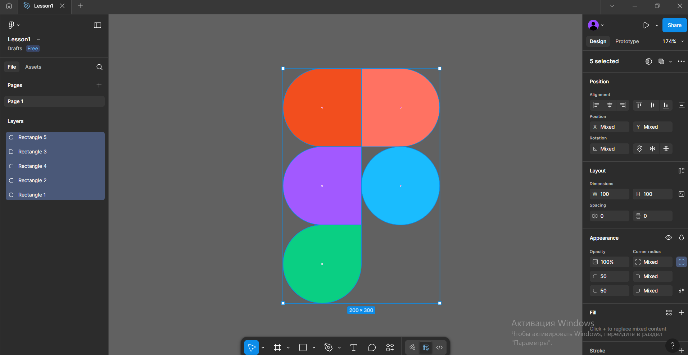

# Workshop_2

## Тема заняття
Робота з простими формами та їх властивостями у Figma. 

## Хід роботи

1. **Створення прямокутників**  
   У Figma я створила 5 фігур типу *Rectangle* для майбутнього логотипа.  

2. **Редагування кутів**  
   Для кожного прямокутника змінювала радіус заокруглення кутів, щоб надати їм більш плавної форми.  

3. **Зміна кольору**  
   Кожній фігурі задала власний колір.  

   
## Висновок  
На практиці я:  
- створила кілька фігур у Figma;  
- відредагувала їхню форму за допомогою зміни радіусу кутів;  
- змінила кольори елементів і отримала готовий логотип.  

Ця робота навчила мене:  
- працювати з базовими інструментами Figma;  
- змінювати властивості об’єктів (форма, колір, кути).

