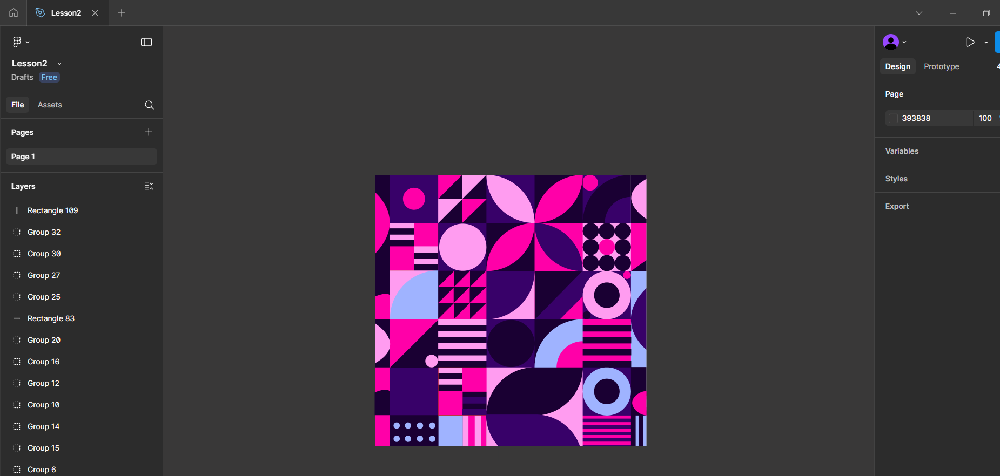

# Workshop_3

## Тема заняття
Робота з простими формами та їх властивостями у Figma. Створення геометричного візерунку.

## Хід роботи

1. **Створення сітки**  
   У Figma я створила квадрат розміром 862.35 × 862.35 та поділила його на сітку, отримавши 25 квадратів  153 × 153, а також половинки квадратів збоку та знизу.

2. **Заповнення фігурами**  
У кожному квадраті розміщувала геометричні елементи: кола, півкола, чверті кіл, трикутники та прямокутники, орієнтуючи їх по-різному.
3. **Застосування кольорів**  
   Для фігур використала контрастні кольори (фіолетовий, рожевий, синій), щоб утворити декоративний орнамент.

   
## Висновок  
На практиці я:  
- створила сітку з квадратів у Figma;
- заповнила їх різними геометричними фігурами (кола, півкола, трикутники, прямокутники);
- підібрала кольори для елементів і сформувала декоративний візерунок. 

Ця робота навчила мене:  
- користуватися сіткою та фігурами у Figma;
- змінювати властивості об’єктів (форма, орієнтація, колір);
- комбінувати прості елементи для створення складного орнаменту.
