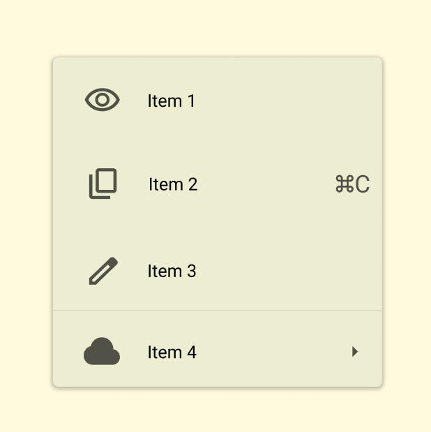
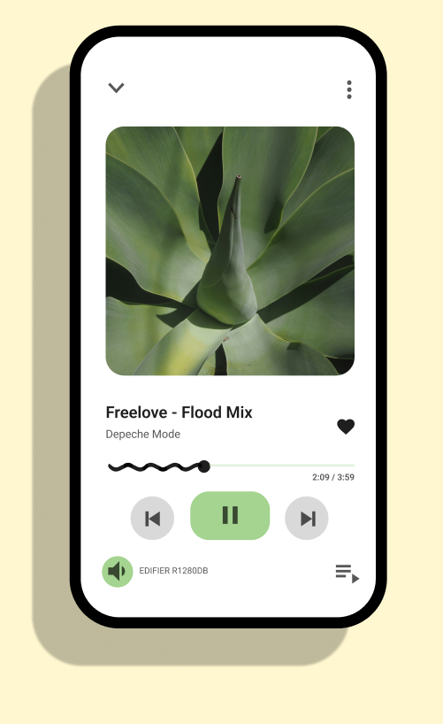
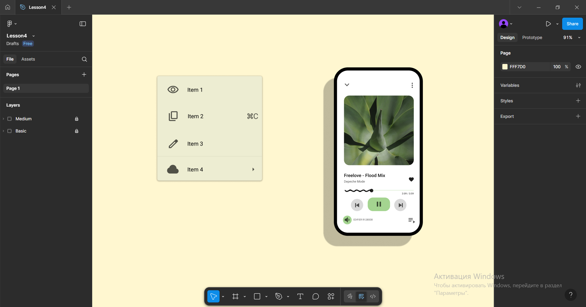

# Workshop_4

## Тема заняття
Фрейми, групи і секції у Figma

## Хід роботи

1. **Підготовка робочого середовища**  
  У Figma створила новий фрейм для макета інтерфейсу. Встановила шрифт Roboto із Google Fonts та імпортувала іконки з розділу Google Fonts Icons, вставивши їх у вигляді SVG.
2. **Завдання Basic**  
Відтворила просте меню з пунктами: Item 1, Item 2, Item 3, Item 4.

Додала векторні іконки (око, копіювання, олівець, хмаринка) з Google Fonts Icons.

Вирівняла елементи та текст відносно іконок.

Додала легку тінь і закруглені кути.
3. **Завдання Medium**  
   Створила інтерфейс музичного програвача на екрані.

Додала прямокутник із закругленими кутами як основу екрана телефону.

Вставила зображення з сайту unsplash.com.

Використала шрифт Roboto із Google Fonts для тексту.

Розмістила іконки (Play, Pause, Forward, Volume, Favourite).

Додала тінь до мобільного телефону.

   

Посилання на проект: https://www.figma.com/design/2rldAFxpOulUeO9VBiBjkW/Lesson4?node-id=0-1&t=popC6AJsVzHFnHLK-1
## Висновок  
На практиці я:  
- навчилася підключати шрифти та іконки з Google Fonts у Figma;
- відтворила елементи, дотримуючись прикладу;
- опрацювала властивості об’єктів: кольори, тіні, вирівнювання, розміри.

Ця робота навчила мене:  
- використовувати іконки у форматі SVG та змінювати їхню заливку (Fill);
- працювати з шрифтами у Figma.
