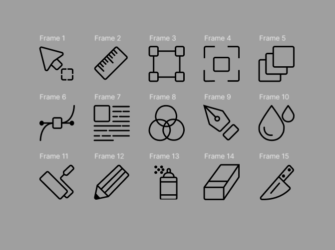

# Workshop_5

## Тема заняття
Криві Безьє, векторні об'єкти  у Figma. Створення векторних значків (іконок).
## Хід роботи

1. **Підготовка робочого середовища**  
  У Figma створила новий фрейм для макета інтерфейсу. 
2. **Створення іконок**  
Створила 15 різних векторних іконок вручну, використовуючи інструмент Перо для малювання кривих Безьє.
Використала Stroke для контурів і Fill для заливки кольором, а також Corner Radius для заокруглення кутів.
Для кожної іконки створила окремий фрейм розміром 24х24.

   

Посилання на проект: https://www.figma.com/design/qEF9bTfBYyfFnl2mK5ms0W/Lesson5?node-id=0-1&t=BqkEghpw0nRfeliG-1
## Висновок  
На практиці я:  
- створила 15 іконок за допомогою інструмента Перо;
- опрацювала принципи побудови кривих Безьє та редагування опорних точок;
- поклала кожну іконку у власний фрейм.

Ця робота навчила мене:  
- користуватися інструментом Перо для створення векторних іконок;
- редагувати криві Безьє та налаштовувати опорні точки;
- налаштовувати заливку, обведення та вирівнювання елементів у Figma. 
