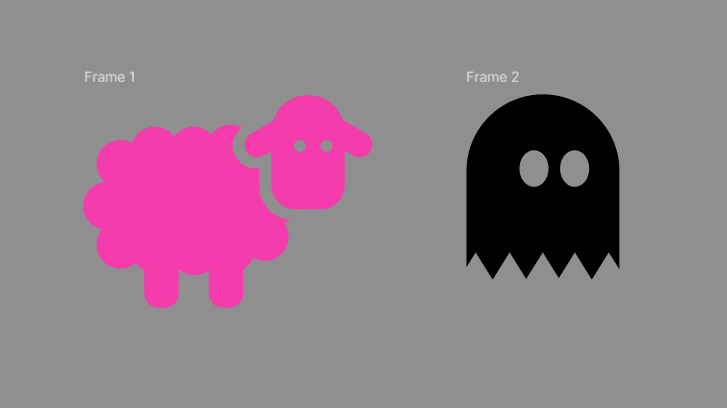

# Workshop_6

## Тема заняття
Булеві групи та flatten у Figma
## Хід роботи

1. **Підготовка робочого середовища**  
  У Figma створила новий фрейм для макета інтерфейсу. 
2. **Створення іконок**  
Створила фігуру вівці: голову й вуха об’єднала за допомогою Union, очі вирізала операцією Subtract

Тіло побудувала з прямокутника та кількох овалів, також об’єднала їх у єдину форму

Створила negative space, щоб відокремити голову від тіла

Усі елементи об’єднала та помістила у фрейм

Далі створила фігуру привида: основу зробила з овалу, нижню частину вирізала трикутниками, а очі овалами, все за допомогою Subtract

Готову іконку також помістила у фрейм 

Кожну іконку об'єднала за допомогою flatten

   

Посилання на проект: https://www.figma.com/design/gNrbcNp5p9eKnv84mmbvcm/Lesson6?node-id=0-1&t=qjhjhpf1zQgXNIIi-1
## Висновок  
На практиці я:  
- навчилася використовувати булеві операції;
- навчилася комбінувати фігури та об’єднувати їх за допомогою Flatten;
- створила дві векторні іконки.

Ця робота навчила мене:  
- застосовувати Boolean Groups для створення іконок;
- використовувати Flatten;
- будувати складні об’єкти з простих форм. 
