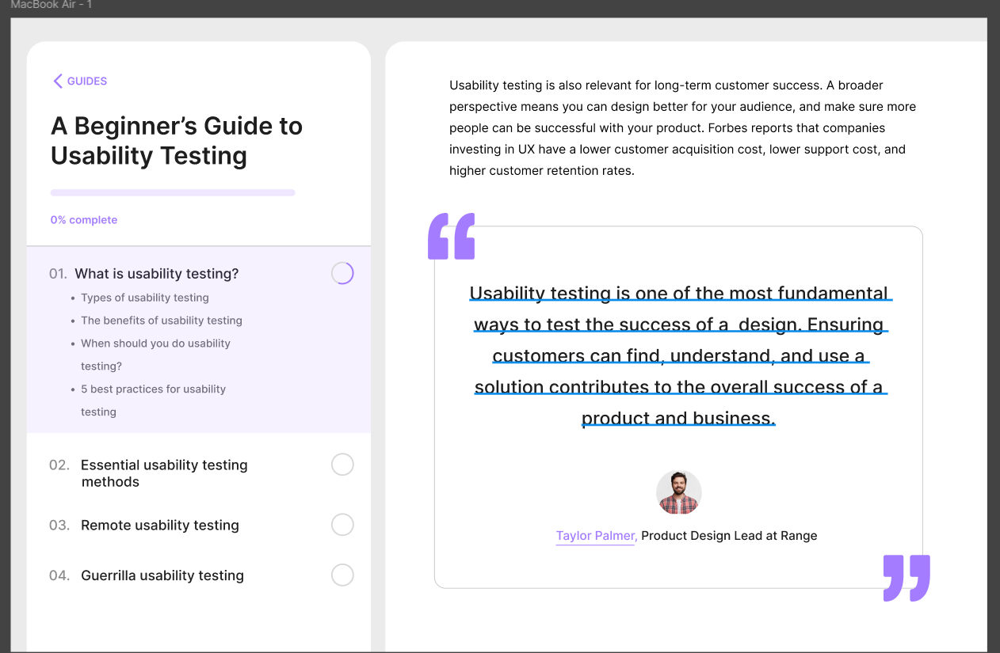

# Workshop_7-8

## Тема заняття
Типографіка в дизайні інтерфейсів
## Хід роботи

1. **Підготовка робочого середовища**  
  У Figma створила новий фрейм для макета інтерфейсу. 
2. **Створення макета списку та текстів**  
Підібрала шрифти для заголовків, підзаголовків і тексту

Налаштувала колір тексту та елементів інтерфейсу

Встановила інтервали між рядками та між абзацами

Для списків із номерами використала ручне форматування, щоб відобразити 01, 02, 03 замість стандартного 1, 2, 3

Додала підкреслення тексту з ім'ям автора

3. **Створення додаткових елементів**  
Створила іконку чоловіка та іконку прогресу за допомогою булевих операцій

Додала іконки лапок та стрілку

   

Посилання на проект: https://www.figma.com/design/ptYeitVuSyZJnz1SwChfSl/Lesson-7-8?node-id=0-1&t=pz5Fm2JKaWJeOSX0-1
## Висновок  
На практиці я:  
- створила дві векторні іконки: іконку чоловіка та іконку прогресу виконання за допомогою булевих операцій;
- підбирала шрифти для текстових елементів, змінювала колір та налаштовувала інтервали між рядками.

Ця робота навчила мене:  
- працювати з текстом та змінювати його властивості.