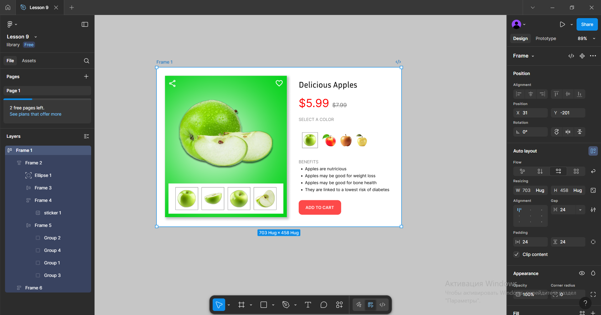

# Workshop_9

## Тема заняття
Функція Auto layout у Figma. Створення картки товару (послуги).
## Хід роботи

1. **Підготовка робочого середовища**  
  У Figma створила новий фрейм для макета картки товару. 
2. **Створення структури картки товару за допомогою Auto Layout**  
Додала головний фрейм картки та застосувала до нього Auto Layout з вертикальним напрямком.

Встановила внутрішні відступи, проміжки між елементами, щоб зробити картку адаптивною.

Створила блок із великим фото яблука та розмістила його в Auto Layout контейнері, на фон додала еліпс з ефектом blur, щоб візуально підсвітити яблуко. Для фото яблука додала тінь.

Додала галерею з маленькими зображеннями. Для цього використала горизонтальний Auto Layout.

Створила блок з назвою товару, ціною та кольорами, використовуючи вертикальні та горизонтальні Auto Layout-и для вирівнювання тексту та елементів.

Створила список «Benefits» і налаштувала для нього інтервали між пунктами.

3. **Створення додаткових елементів**  
Додала кнопку “Add to cart” та зробила її окремим Auto Layout елементом із вирівнюванням по центру.

Налаштувала стилі тексту, кольори, тіні та відступи, щоб картка виглядала візуально краще.

   

Посилання на проект: https://www.figma.com/design/yxliIohTQIijylg6NWLwYx/Lesson-9?node-id=0-1&t=uwCgQvtZ39Uj3Gbk-1
## Висновок  
На практиці я:  
- створила адаптивну картку товару з використанням Auto Layout;
- застосовувала вертикальні та горизонтальні Auto Layout-и для побудови елементів у картці;
- працювала з текстом, кнопками, зображеннями та галереєю товару.

Ця робота навчила мене:  

- правильно структурувати картку товару за допомогою Auto Layout;

- будувати гнучкі інтерфейсні компоненти в Figma;
